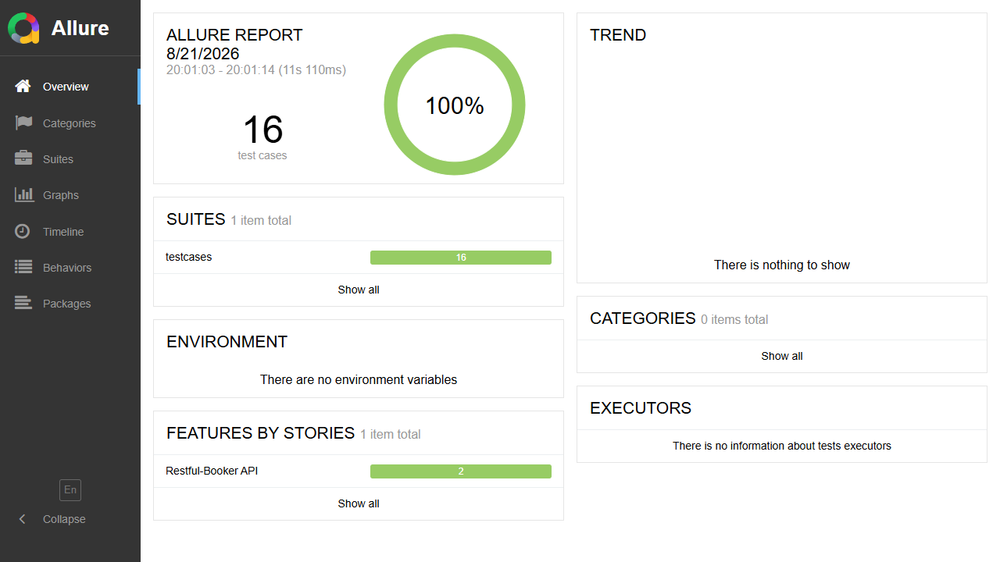
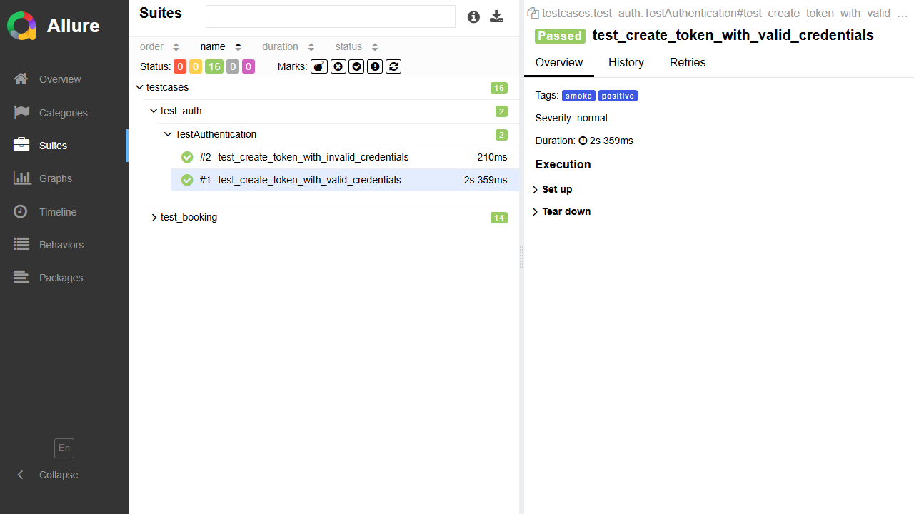
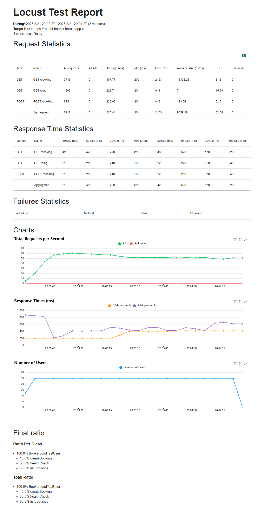

# Restful-Booker API 自动化测试项目

面向软件测试岗位的接口自动化作品集。以公开练习 API [Restful-Booker](https://restful-booker.herokuapp.com/) 为被测系统，覆盖认证、Booking 的增删改查、异常输入与鉴权校验；同一套业务接口层同时服务于 `pytest` 自动化回归与 `Locust` 小规模性能测试。

## 技术栈

- Python 3.12、pytest、requests
- Allure Pytest（可视化测试报告）
- Locust（HTTP 性能测试）
- GitHub Actions（push / PR 持续集成）

## 项目结构

```text
common/                 # Session 请求封装与 Booking 业务接口层
config/                 # 环境配置，支持 .env 覆盖
testcases/              # pytest 用例与 fixture
reports/                # Allure 原始结果、Locust 报告输出
docs/screenshots/       # 运行后提交 Allure / Locust 截图的位置
locustfile.py           # 性能测试脚本
.github/workflows/      # GitHub Actions
```

## 用例设计思路

| 类别 | 覆盖场景 |
| --- | --- |
| 正向 | 健康检查、获取 token、创建/查询/筛选订单、全量更新、部分更新、删除 |
| 反向 | 错误凭据、查询不存在订单、无 token 更新、无效 token 删除、重复删除 |
| 边界 | 256 字符姓名、缺失字段；将公开 API 的实际宽松校验行为固化为可见结果 |

目前共有 16 条用例，按 `smoke`、`positive`、`negative`、`boundary`、`auth` 标记组织。测试数据通过 fixture 自动创建；常规用例结束后会尝试清理，避免污染公共环境。

## 本地运行

```bash
python -m venv .venv
.venv\\Scripts\\activate       # Windows PowerShell
pip install -r requirements.txt
Copy-Item .env.example .env       # 可选：覆盖目标环境与账号
pytest -v --alluredir=reports/allure-results
allure serve reports/allure-results
```

只运行核心回归：

```bash
pytest -m smoke --alluredir=reports/allure-results
```

## Allure 报告

执行测试后用 `allure serve reports/allure-results` 打开报告。将概览页与用例详情页截图保存为：

- `docs/screenshots/allure-overview.png`
- `docs/screenshots/allure-case-detail.png`





> CI 会在每次 push/PR 时执行 smoke 用例，并上传 Allure 原始结果作为 artifact。

## 性能测试

压测脚本通过 `LocustRequestClient` 适配并复用 `BookingApi` 业务接口层，混合访问订单列表、健康检查与创建订单（权重为 6:3:1）。

```bash
locust -f locustfile.py --headless -u 50 -r 5 -t 2m --html reports/locust-report.html
```

本仓库已保留一次真实运行的报告截图：



| 并发用户 | 时长 | RPS | 平均响应时间 | 失败率 | 结论 |
| ---: | ---: | ---: | ---: | ---: | --- |
| 50 | 2 分钟 | 52.04 | 323.41 ms | 0.00% | 6,217 个请求全部成功；`GET /booking` P95 为 620ms、P99 为 1.7s，是主要长尾点 |

## 可继续优化

1. 用 Pydantic/JSON Schema 做响应契约校验，并接入 Allure 附件（请求、响应、日志）。
2. 将测试数据、账号和目标环境迁入 GitHub Secrets / 多环境配置。
3. 在 CI 中发布 Allure HTML，并增加失败重试、通知与质量阈值。
4. 基于真实压测数据分离读写场景，加入 P95/P99、资源监控与容量结论。
